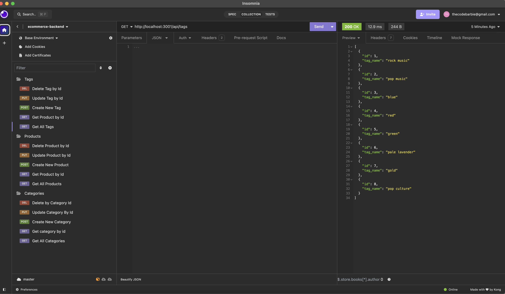

# E-Commerce Backend


## Description

The E-Commerce Backend is a command-line application designed to manage a company's product, category, and tag data. The application is built using Node.js, Sequelize, and MySQL, and it provides a powerful interface for managing and interacting with the database.

## Table of Contents

- [Installation](#installation)
- [Usage](#usage)
- [Walkthrough Video](#walkthrough-video)
- [Database Schema](#database-schema)
- [API Endpoints](#api-endpoints)
- [License](#license)
- [Contributing](#contributing)
- [Questions](#questions)

## Installation

1. Clone the repository:
    ```bash
    git clone https://github.com/your-username/C13-Ecomm-Backend.git
    cd C13-Ecomm-Backend
    ```

2. Install dependencies:
    ```bash
    npm install
    ```

3. Set up the database:
    - Create a `.env` file in the root directory and add your database credentials:
        ```plaintext
        DB_NAME='ecommerce_db'
        DB_USER='your_mysql_username'
        DB_PASSWORD='your_mysql_password'
        ```

    - Create the database and tables:
        ```bash
        npm run db:reset
        ```

4. Seed the database:
    ```bash
    npm run seed
    ```

5. Start the application:
    ```bash
    npm start
    ```

## Usage

Once the application is running, you can use a tool like Insomnia or Postman to interact with the API. The following endpoints are available:

- **Products**
  - `GET /api/products` - Get all products
  - `GET /api/products/:id` - Get a product by ID
  - `POST /api/products` - Create a new product
  - `PUT /api/products/:id` - Update a product by ID
  - `DELETE /api/products/:id` - Delete a product by ID

- **Categories**
  - `GET /api/categories` - Get all categories
  - `GET /api/categories/:id` - Get a category by ID
  - `POST /api/categories` - Create a new category
  - `PUT /api/categories/:id` - Update a category by ID
  - `DELETE /api/categories/:id` - Delete a category by ID

- **Tags**
  - `GET /api/tags` - Get all tags
  - `GET /api/tags/:id` - Get a tag by ID
  - `POST /api/tags` - Create a new tag
  - `PUT /api/tags/:id` - Update a tag by ID
  - `DELETE /api/tags/:id` - Delete a tag by ID

## Walkthrough Video

A walkthrough video demonstrating the functionality of the application is available at the following link:

[Walkthrough Video](https://drive.google.com/file/d/1L6Qukdz-2ExuGKkrWm6s9zH-WsXcBpWZ/view?usp=drive_link)
[Walkthrough Video](https://drive.google.com/file/d/1RdvqK6AazK_t5f3jrqzGxd8R4EribdcT/view?usp=sharing)

## Database Schema

The database schema consists of the following tables:

- **Product**
  - `id`: `SERIAL PRIMARY KEY`
  - `product_name`: `VARCHAR(30) NOT NULL`
  - `price`: `DECIMAL NOT NULL`
  - `stock`: `INTEGER NOT NULL`
  - `category_id`: `INTEGER REFERENCES category(id)`

- **Category**
  - `id`: `SERIAL PRIMARY KEY`
  - `category_name`: `VARCHAR(30) NOT NULL`

- **Tag**
  - `id`: `SERIAL PRIMARY KEY`
  - `tag_name`: `VARCHAR(30) NOT NULL`

- **ProductTag**
  - `id`: `SERIAL PRIMARY KEY`
  - `product_id`: `INTEGER REFERENCES product(id) ON DELETE CASCADE`
  - `tag_id`: `INTEGER REFERENCES tag(id) ON DELETE CASCADE`

Here is an image representing the schema:



## License

This project is licensed under the MIT License.

## Contributing

Contributions are welcome! Please Click the link under questions to connect with me on Github and Gmail.

## Questions

If you have any questions, feel free to open an issue or contact me directly:

- GitHub: [thecodebarbie](https://github.com/thecodebarbie)
- Email: thecodebarbie@gmail.com
